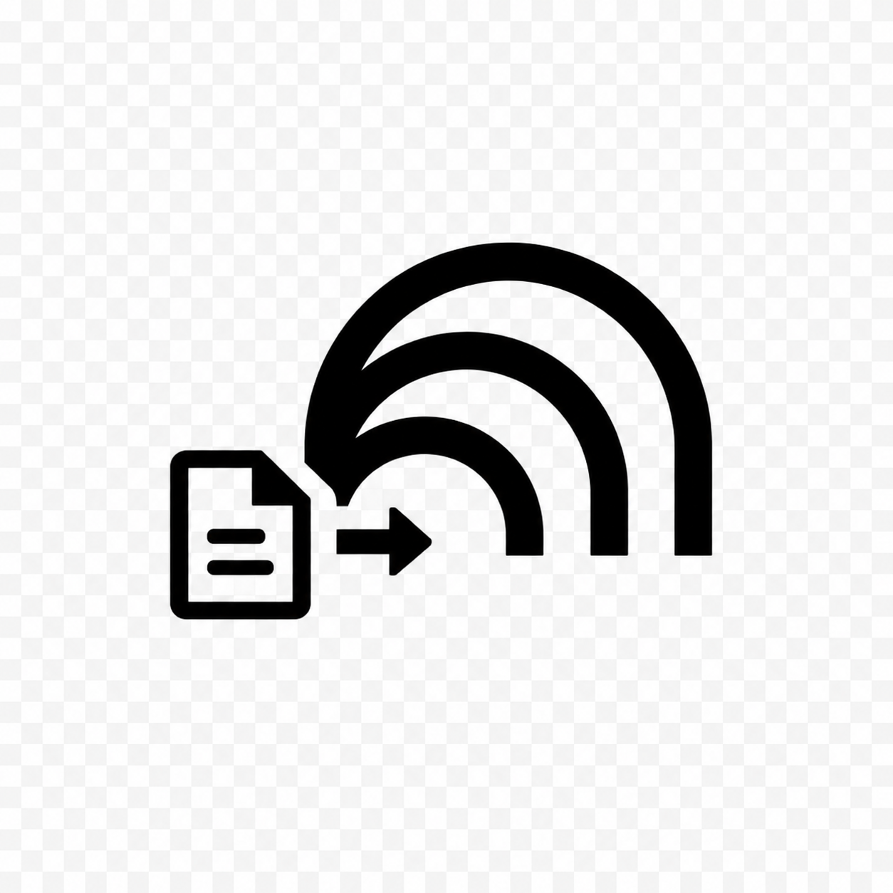
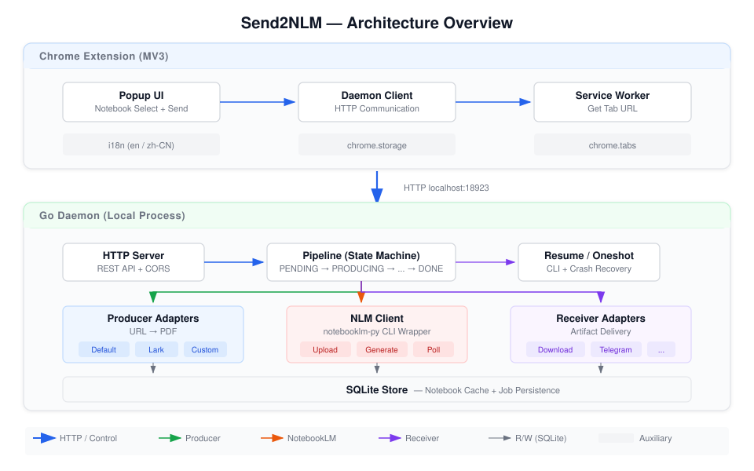

# Send2NLM

> 一键将当前网页以 PDF 格式发送到 Google NotebookLM。

[English](./README.md) | [简体中文](./README.zh-CN.md)

<p align="center">
  
</p>

<p align="center">
  
</p>

---

## 这是什么？

Send2NLM 是一个 **Chrome 浏览器扩展 (MV3)**，将你正在浏览的网页以 PDF 格式发送到 [Google NotebookLM](https://notebooklm.google.com)，还可自动触发**音频概览**（深度播客）、**AI 幻灯片**和**视频概览**生成。

一个轻量级的**本地 Go 守护进程**负责所有繁重工作 —— URL → PDF 转换、上传至 NotebookLM、任务生成、状态轮询和产物下载。无需浏览器自动化，无需脆弱的 DOM 操作。

---

## 特性

- 🚀 **一键发送** — 点击一下，当前网页即刻发送到指定笔记本。无需复制粘贴，无需手动上传。
- 🎙️ **AI 智能生成** — 把任意文章变成深度播客、演示文稿、视频概览等更多形式 —— 全部由 NotebookLM AI 驱动。
- 🔔 **自动投递** — 发送后无需等待。Daemon 自动监听生成进度，完成后将产物投递到你需要的任何位置。
- 🔌 **可扩展适配器** — 处理任意网站，接入任意投递渠道。几行 Go 代码即可教 Send2NLM 如何转换特定网页、或将结果发送到哪里。
- 🌐 **中英双语** — 开箱即用的国际化支持。

---

## 工作原理

```
   ┌──────────────────────┐
   │  Chrome 扩展          │     ① 点击扩展图标
   │  ┌────────┐┌───────┐│     ② 选择目标笔记本
   │  │Popup UI││ SW BG ││     ③ 点击"发送"
   │  └────────┘└───────┘│
   └─────────┬────────────┘
             │ HTTP POST /jobs
             ▼
   ┌─────────────────────────────────────────┐
   │           Go Daemon (流水线)              │
   │                                          │
   │  ┌──────────┐   ┌──────────┐            │
   │  │PRODUCING │──▶│UPLOADING │──▶ ... ──▶│
   │  │URL → PDF │   │上传至NLM  │            │  完成
   │  └──────────┘   └──────────┘            │
   │       │               │                  │
   │       ▼               ▼                  │
   │  Producer         notebooklm-py         │
   │  适配器              CLI                 │
   └─────────────────────────────────────────┘
```

1. **PRODUCING（生产）** — URL 转换为 PDF。自定义适配器处理特定站点（如飞书文档通过 `lark-cli`）；内置 Default 适配器处理其他页面（HTTP 抓取 → Markdown → PDF）。
2. **UPLOADING（上传）** — PDF 通过 `notebooklm-py` 上传到目标 NotebookLM 笔记本。
3. **TASKING（任务）** — 触发用户选择的任务（音频概览 / 幻灯片 / 视频概览）。
4. **POLLING（轮询）** — Daemon 先等待 10 分钟，然后每 1 分钟轮询一次任务状态，直到全部完成（总上限 60 分钟；失败前会做最后一次状态查询；daemon 重启后可继续）。
5. **DOWNLOADING（下载）** — 生成的产物下载到本地磁盘。
6. **RECEIVING（投递）** — 产物投递到配置的接收器（本地 Downloads 文件夹、Telegram 等）。

---

## 前置条件

| 依赖 | 安装方式 | 说明 |
|------|----------|------|
| [Go](https://go.dev/dl/) | ≥ 1.21 | 构建 daemon |
| [notebooklm-py](https://github.com/teng-lin/notebooklm-py) | `uv tool install "notebooklm-py[cookies]"` | Google RPC API 客户端 |
| [opencli](https://github.com/anthropics/opencli) | `npm i -g opencli` | 网页内容抓取 |
| Chrome / Chromium | ≥ 110 | MV3 支持；同时用于 cookie 认证 |
| `pandoc` + `xelatex` | `brew install pandoc`<br>`brew install --cask mactex` | Markdown→PDF 转换（Default Producer 必需） |

### 一次性配置

```bash
# 1. 安装 notebooklm-py 并通过浏览器 cookie 完成认证
uv tool install "notebooklm-py[cookies]"

# 2. 查看浏览器中已登录的 Google 账号
notebooklm auth inspect --browser chrome

# 3. 复用浏览器 cookie 登录（无需打开新窗口）
notebooklm login --browser-cookies chrome --account your@gmail.com

# 4. 验证认证状态
notebooklm auth check --test --json
```

---

## 安装

### 从源码构建

```bash
git clone https://github.com/your-org/send2nlm.git
cd send2nlm

# 构建 Go daemon
cd daemon
go build -o send2nlm .
sudo cp send2nlm /usr/local/bin/

# 加载 Chrome 扩展
# 1. 打开 chrome://extensions
# 2. 启用"开发者模式"
# 3. 点击"加载已解压的扩展程序" → 选择 extension/ 目录
```

### 启动 daemon

```bash
# 作为后台服务启动
send2nlm daemon

# 指定自定义端口
send2nlm daemon --port 18923

# One-shot 模式（无需 daemon 常驻）
send2nlm send --notebook "abc123" --url "https://example.com" --tasks audio_overview,slide_deck,video_overview
```

---

## 使用方式

1. 点击 Chrome 工具栏中的 **Send2NLM 图标** 🧩
2. 从列表**选择笔记本**（或新建一个）
3. 勾选**音频概览**、**幻灯片**和/或**视频概览**
4. 点击**发送**
5. 观察进度 —— 流水线自动处理每一步
6. 完成后，点击**在 NotebookLM 中查看**打开笔记本

---

## 配置

所有配置位于 `~/.send2nlm/`：

```
~/.send2nlm/
├── config.json          # Daemon 及接收器设置
├── producer/            # 自定义 URL→PDF 适配器 (*.go)
├── receiver/            # 自定义投递适配器 (*.go)
├── cache/               # 编译后的适配器二进制缓存
├── tmp/                 # 临时 PDF 及下载文件
├── send2nlm.db          # SQLite 数据库
├── daemon.port          # 当前 daemon 端口
└── daemon.pid           # 当前 daemon PID
```

### `config.json`

```json
{
  "receivers": {
    "download": { "enabled": true },
    "lark": {
      "enabled": false
    },
    "telegram": {
      "enabled": false,
      "bot_token": "你的_BOT_TOKEN",
      "chat_id": "你的_CHAT_ID"
    }
  }
}
```

启用 `lark` 后会通过 `lark-cli im +messages-send --as bot` 给当前登录
`lark-cli` 的用户发送完成消息和产物，不直接调用 OpenAPI 端点。

---

## 自定义适配器

### 编写 Producer（URL → PDF）

将 `.go` 文件放入 `~/.send2nlm/producer/`，daemon 会自动编译并缓存。

```go
// ~/.send2nlm/producer/my_site.go
package producer

import (
    "context"
    "strings"
    "send2nlm/sdk"
)

type MyProducer struct{}

func (p *MyProducer) Name() string          { return "my-site" }
func (p *MyProducer) Match(url string) bool { return strings.Contains(url, "mysite.com") }
func (p *MyProducer) Produce(ctx context.Context, url string) (string, error) {
    // 将 URL 生成为 PDF → 返回文件路径
    return "/tmp/send2nlm/output.pdf", nil
}

var Producer sdk.Producer = &MyProducer{}
```

### 编写 Receiver（产物投递）

将 `.go` 文件放入 `~/.send2nlm/receiver/`：

```go
// ~/.send2nlm/receiver/my_receiver.go
package receiver

import (
    "context"
    "send2nlm/sdk"
)

type MyReceiver struct{}

func (r *MyReceiver) Name() string { return "my-receiver" }
func (r *MyReceiver) Receive(ctx context.Context, resources []sdk.Resource) error {
    // 投递产物：邮件、Slack、Webhook 等
    cfg := sdk.LoadConfig().Receivers["my-receiver"]
    _ = cfg
    return nil
}

var Receiver sdk.Receiver = &MyReceiver{}
```

在 `config.json` 中启用/禁用：

```json
{
  "receivers": {
    "my-receiver": { "enabled": true }
  }
}
```

---

## 开发

```bash
# 以开发模式启动 daemon（使用 dev_assets/ 替代 ~/.send2nlm/）
cd daemon && go run . daemon --dev

# 或通过环境变量
SEND2NLM_DEV=1 go run . daemon

# 加载扩展
# Chrome → chrome://extensions → "加载已解压的扩展程序" → extension/
```

### 项目结构

```
send2nlm/
├── extension/           # Chrome 扩展 (MV3)
│   ├── popup/           #   UI：笔记本选择、发送、进度
│   ├── background/      #   Service Worker
│   └── shared/          #   通信客户端 & i18n 辅助
├── daemon/              # Go 守护进程
│   ├── server/          #   HTTP 服务 & API 处理
│   ├── core/            #   流水线编排 & 配置
│   ├── store/           #   SQLite 持久化
│   ├── nlm/             #   notebooklm-py CLI 封装
│   ├── producer/        #   内置 Default Producer
│   ├── receiver/        #   内置 Download Receiver
│   ├── converter/       #   Markdown → PDF 转换器
│   ├── scriptmgr/       #   适配器发现、编译、缓存
│   ├── sdk/             #   共享接口 & stdio 协议
│   └── resources/       #   内嵌适配器 (Lark, Telegram)
├── scripts/             # 适配器示例
├── dev_assets/          # 开发环境模拟目录
└── DESIGN.md            # 完整设计文档
```
